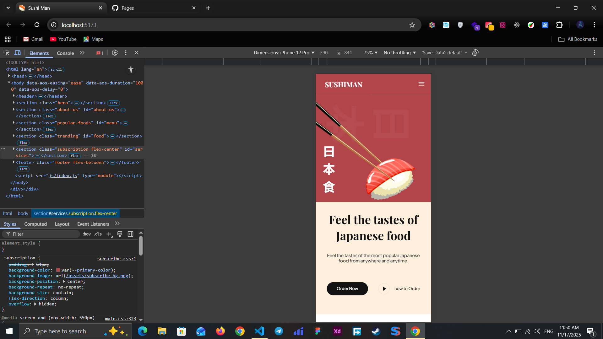
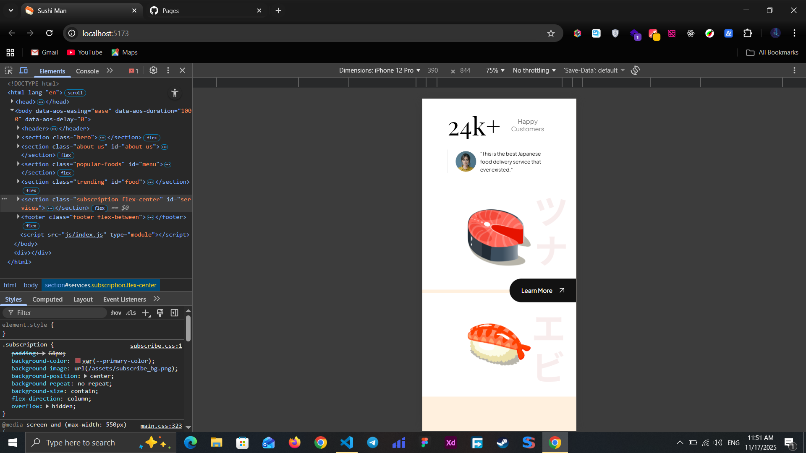

# Front-End Website Project

این پروژه یک وب‌سایت فرانت‌اند است که با استفاده از **HTML** و **CSS** توسعه داده شده و کاملاً **ریسپانسیو** طراحی شده است تا در تمامی دستگاه‌ها (موبایل، تبلت و دسکتاپ) نمایش مناسبی داشته باشد.

در این پروژه از کتابخانه **AOS (Animate On Scroll)** برای ایجاد افکت‌های اسکرول نرم و چشم‌نواز استفاده شده است. این افکت‌ها تجربه کاربری بهتری ایجاد کرده و ظاهر پروژه را جذاب‌تر می‌کنند.

## ویژگی‌ها
- طراحی کامل با HTML و CSS بدون فریم‌ورک
- ریسپانسیو و سازگار با تمامی ابعاد صفحه
- استفاده از انیمیشن‌های AOS هنگام اسکرول
- ساختار مرتب و قابل توسعه
- کامنت‌گذاری مناسب برای خوانایی بیشتر

## تکنولوژی‌های استفاده شده
- HTML5
- CSS3  
- AOS Library  

## اسکرین‌شات پروژه
در ادامه یک تصویر از ظاهر پروژه قرار داده شده است:

       
       
       
       
       
